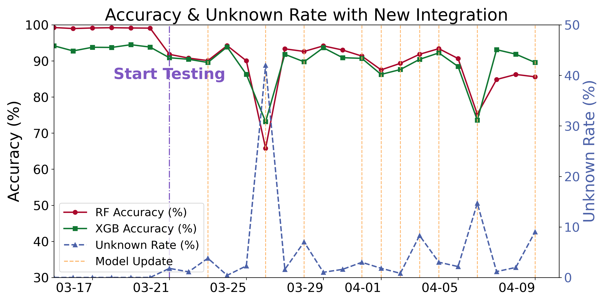
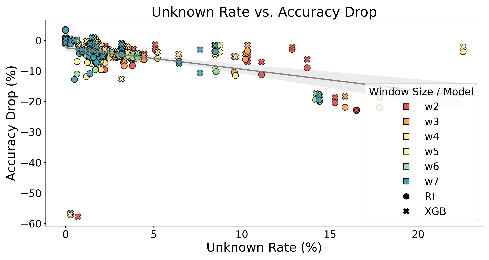
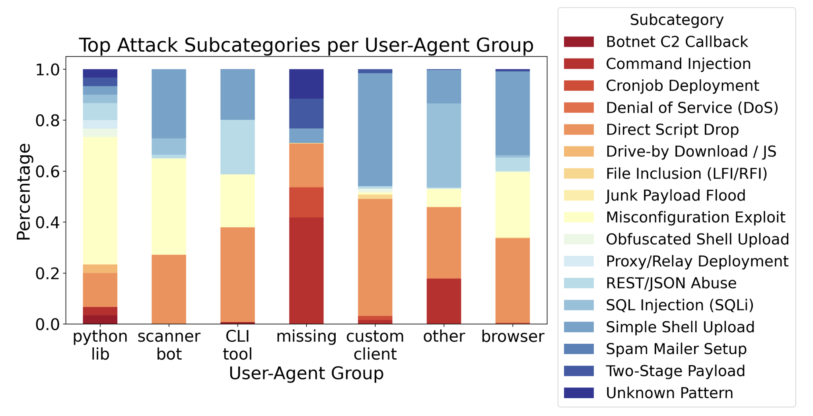

# TwinGuard: Adaptive Digital Twin for Intrusion Detection

TwinGuard is a lightweight, adaptive intrusion detection system that leverages trie-based sequence modeling and dual machine learning classifiers to detect evolving HTTP(S) attacks in real time, while also supporting long-term behavioral profiling. 

It implements a **digital twin** framework, where the physical layer—consisting of real-world attacker behavior captured by honeypots—is mirrored by a virtual model that evolves continuously through sequence tracking and adaptive detection.

### Conda Environment
To reproduce the exact environment used in this project, use the conda environment:
```
conda env create -f environment.yml
conda activate twinguard
```

## Key Features
- Trie-based sequence modeling  
- Dual machine learning classifiers (RF + XGBoost)  
- Digital twin framework (physical ↔ virtual layers)  
- Adaptive retraining based on unknown patterns  
- Fingerprinting + hierarchical intrusion labeling  

## Project Structure
```
TwinGuard/
├── physical/                    # Data Query and Feature Engineering                 
├── virtual/
│   └── dt.py                    # Main script: adaptive digital twin loop
├── intelligence/                # Behavior Profiling
│   ├── uafin.py, cloudfin.py    # statistical fingerprinting
│   ├── regmatching.py           # Hierarchical Labeling
│   └── map.py                   # Map labeling to ua and cloud
├── integration/                 # Digital Twin Integration from a new source
│   ├── formatjson.py            # json -> csv
│   ├── feature.py               # feature engineering with new data
│   └── dt_integrate.py          # Evaluation with new data source in an adaptive digital twin loop

======================= ↑ Core Components of TwinGuard================================================

├── others/                      # Visualizations and base sensitive words dictionary generation
├── data/                        # Raw and processed honeypot data
│   ├── daily/                   # Daily HTTP session logs (CSV) - Raw data
│   ├── dt/                      # digital twin operation logs under different windows
│   ├── encoded/                 # Feature-engineered data
│   ├── fingerprinting/          # behavior profiling data
│   ├── integration/             # integration of a different source
│   └── trie/                    # Sensitive word list & probabilistic trie model
├── figs   
├── environment.yml              # Conda environment setup
└── README.md                    # Project documentation
```

## Partial Results
<table>
  <tr>
    <td align="center">
      <br>
      <em>🔁 Adaptive Retraining Effectiveness to a new honeypot source: A surge in unknown sequences and an accuracy drop is observed upon integration, followed by recovery after retraining.</em>
    </td>
    <td align="center">
      <br>
      <em>📉 Accuracy Drop vs. Unknown Rate: Higher unknown rates correlate with larger accuracy drops</em>
    </td>
  </tr>
  <tr>
    <td align="center">
      <br>
      <em>🔎 User-Agent Behavioral Fingerprinting: Intrusion patterns vary across user-agent groups</em>
    </td>
    <td align="center">
      <br>
      <em>🧠 Intrusion Categories by User-Agent Group: Top attack techniques differ by client behavior and tooling</em>
    </td>
  </tr>
</table>


## Acknowledgement
